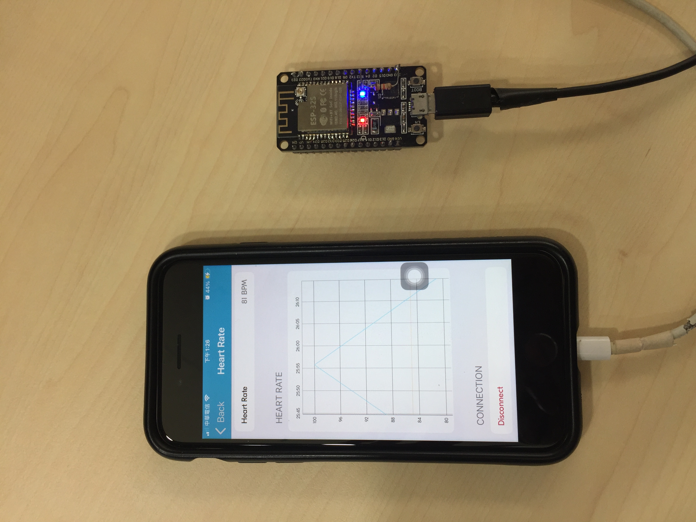

## Install Arduino IDE 2.3.6
[link](https://www.arduino.cc/en/software/)  

## Add esp32 Board and build
1. File -> Preferences -> Additional boards manager URLs -> `https://espressif.github.io/arduino-esp32/package_esp32_index.json`  
2. Boards manager -> search `esp32` by espressif systems -> install  
3. Select board `DOIT ESP32 DEVKIT V1`  
4. Verify then Upload  
5. Open `nRF Toolbox` to connect by `HRS`  

## Demo on nRF Toolbox
  

## Reference
[link](https://github.com/rikard-engstrom/esp32-ble-hrm-garmin.git)  
